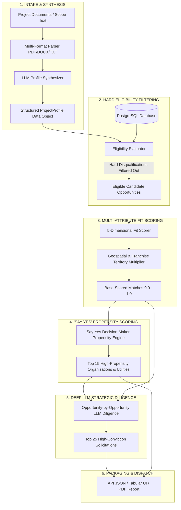
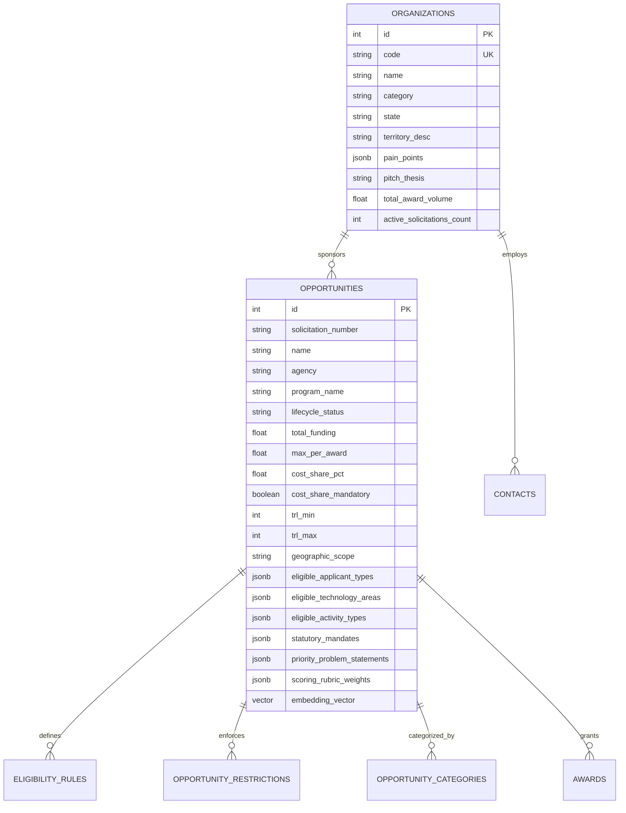
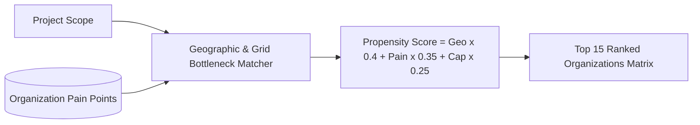
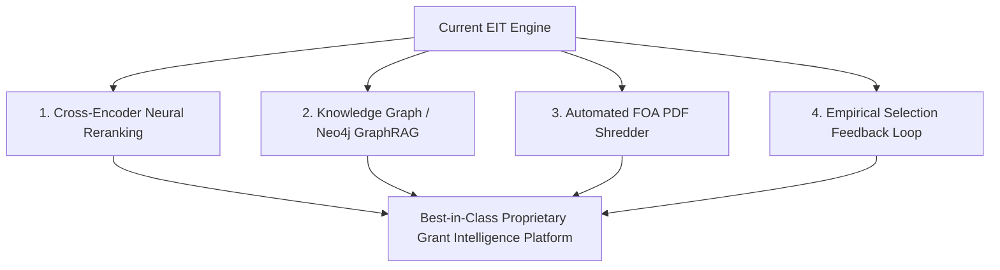

# Technical Manual: Proprietary Clean Energy Opportunity & Decision-Maker Matching Algorithm

**Document Version:** 4.0.0-PROPRIETARY  
**System Designation:** Energy Innovation Terminal Matching Engine (`EIT-MatchEngine`)  
**Publisher:** Clean Energy Research, LLC  
**Platform URL:** [https://terminal.aixenergy.io](https://terminal.aixenergy.io)  
**Database Reference:** U.S. Energy Innovation Database  
**Target Environment:** PostgreSQL 16+ with `pgvector`, FastAPI Core, OpenAI GPT-4o / Google Gemini Enterprise  
**Classification:** Proprietary Technical Architecture & Algorithm Specification  

---

## 1. Executive Architecture & Engineering Objective

The **Energy Innovation Terminal Matching Engine** is a deterministic, multi-stage hybrid intelligence system designed to solve the capital-project matching problem for clean energy innovation, grid infrastructure, and deep decarbonization technologies.

Unlike naive keyword or vector-only search engines, `EIT-MatchEngine` executes a **6-stage pipeline** that couples **deterministic statutory filtering**, **5-dimensional weighted multi-attribute utility theory (MAUT)**, **geospatial/utility franchise territory calibration**, **decision-maker pain point propensity scoring**, and **deep opportunity-by-opportunity LLM strategic reasoning**.



---

## 2. Input Data Architecture & Field Specifications

The matching engine accepts two entry pathways: **Structured API Inputs** and **Unstructured Document Ingestion**.

### 2.1 Raw Input Parameter Specification

| Field Name | Type | Description | Mandatory | Validation / Permitted Range |
| :--- | :--- | :--- | :---: | :--- |
| `text` | `string` | Unstructured project description, executive summary, or proposal excerpt. | Cond. | Max 50,000 chars. |
| `location` | `string` | Geographic footprint (e.g., `"Brooklyn, NY"`, `"Fresno, CA"`). | Yes | Resolved to City, County, State, ISO Zone. |
| `applicant_type` | `string` | Statutory entity type of lead applicant. | Yes | `business`, `university`, `nonprofit`, `municipality`, `consortium`. |
| `cost` | `float` | Estimated total project capital requirement ($ USD). | Yes | $\$10,000 \le \text{cost} \le \$5,000,000,000$. |
| `trl` | `integer` | Technology Readiness Level. | Yes | $1 \le \text{TRL} \le 9$ (NASA / DOE standard). |
| `timeline` | `string` | Proposed deployment duration (e.g., `"2025-2027"`). | No | Year / Quarter strings. |
| `partners` | `string` | Confirmed or sought teaming partners. | No | Comma-separated names. |
| `technology_areas` | `list[str]` | Core technology taxonomy domains. | Yes | Permitted list of 15 canonical sectors. |
| `activity_types` | `list[str]` | Scope of work categories. | Yes | `Applied R&D`, `Pilot Demonstration`, `Commercial Scale-Up`, etc. |
| `sectors` | `list[str]` | Target end-use sectors. | No | `Electric Power`, `Industrial`, `Buildings`, `Transport`, etc. |
| `fuel_types` | `list[str]` | Energy carrier / resource inputs. | No | `Electricity`, `Hydrogen`, `Solar`, `Thermal`, etc. |
| `agencies` | `list[str]` | Targeted funding bodies and utilities. | No | Filter set; in-state agencies auto-injected. |

### 2.2 Canonical Taxonomies & Mapping Tables

The system maintains bi-directional taxonomy mapping dictionaries (`TAXONOMY_ALIASES` and `ACTIVITY_ALIASES`) containing over 350 normalized clean energy keywords.

```python
TAXONOMY_ALIASES = {
    "Data Centers & Computing": [
        "data center", "datacenter", "compute", "immersion cooling", "liquid cooling",
        "gpu cluster", "pue", "it load", "thermal management", "power safety"
    ],
    "Grid Modernization": [
        "grid", "substation", "transmission", "distribution", "smart grid",
        "microgrid", "der", "derms", "pmu", "hosting capacity", "inverter"
    ],
    "Energy Storage": [
        "battery", "energy storage", "bess", "ldes", "lithium", "flow battery",
        "iron-air", "thermal storage", "compressed air", "behind the meter"
    ],
    "Building Electrification": [
        "heat pump", "hvac", "building electrification", "cold climate",
        "geothermal heat", "building envelope", "space heating", "retrofit"
    ],
    "Clean Transportation": [
        "electric vehicle", "ev", "charging", "v2g", "fleet", "transit",
        "evse", "megawatt charging", "heavy duty truck"
    ],
    "Hydrogen & Alternative Fuels": [
        "hydrogen", "electrolyzer", "fuel cell", "clean hydrogen", "ammonia",
        "saf", "sustainable aviation fuel", "e-fuel"
    ],
    "Industrial Decarbonization": [
        "industrial heat", "process heat", "kiln", "furnace", "cement",
        "steel", "waste heat recovery", "industrial electrification"
    ]
}
```

---

## 3. Database Schema & PostgreSQL Metadata Optimization

The platform utilizes **PostgreSQL** exclusively. All opportunities, organizations, awards, and historical precedents are indexed with strict relational constraints and metadata columns.



### Key Relational Fields for High-Conviction Matching:
- **`statutory_mandates` (`jsonb`)**: Formal legislative acts and utility orders driving funding (e.g., `["CLCPA § 75-0107", "NYC Local Law 97", "FERC Order 2222"]`).
- **`priority_problem_statements` (`jsonb`)**: Granular technical bottlenecks targeted by program directors (e.g., `["4-hour to 12-hour duration storage in high-density urban vaults", "Reconductoring alternatives for feeder congestion"]`).
- **`scoring_rubric_weights` (`jsonb`)**: Exact evaluation point breakdowns (e.g., `{"technical_merit": 35, "market_readiness": 25, "community_benefits": 20, "budget_cost_share": 20}`).
- **`teaming_partner_types_sought` (`jsonb`)**: Required consortium partners (e.g., `["Host Site Utility", "Disadvantaged Community CBO", "National Laboratory"]`).

---

## 4. Multi-Stage Matching Algorithm & Mathematical Formulation

### Stage 1: Deterministic Hard Eligibility Screening
Before computing continuous fit metrics, each candidate solicitation is evaluated against binary constraints. If any **hard rule** fails, the opportunity is disqualified.

$$\text{Eligible}(O, P) = \bigwedge_{r \in R_{\text{hard}}(O)} \text{Pass}(r, P)$$

Where rules include:
1. **Applicant Type Rule**: $P.\text{applicant\_type} \in O.\text{eligible\_applicant\_types}$
2. **Cost-Share Feasibility**: If $O.\text{cost\_share\_mandatory} = \text{True}$ and $P.\text{cost\_share\_capacity} < O.\text{cost\_share\_pct}$, fail or flag.
3. **Hard TRL Bounds**: $[P.\text{trl}_{\min}, P.\text{trl}_{\max}] \cap [O.\text{trl}_{\min}, O.\text{trl}_{\max}] \neq \emptyset$.
4. **Hard Geographic Boundary**: State-specific grant funds cannot fund out-of-state entities without in-state host site / demonstration partner.

---

### Stage 2: 5-Dimensional Quantified Fit Scoring (MAUT)

For eligible opportunities, the engine calculates a base fit score across five orthogonal dimensions:

$$S_{\text{base}}(O, P) = \sum_{i=1}^{5} w_i \cdot D_i(O, P)$$

$$\sum_{i=1}^{5} w_i = 1.0, \quad \text{where } w = \{0.40, 0.30, 0.10, 0.10, 0.10\}$$

#### 1. Keyword & Semantic Topic Alignment ($D_1$, Weight = 40%)
Evaluates domain vocabulary density across solicitation titles, objectives, problem statements, and selection criteria:

$$D_1(O, P) = \min\left(1.0, \frac{\sum_{k \in K(P)} \mathbb{I}(k \in \text{Corpus}(O)) \cdot \text{IDF}(k)}{\text{MaxScore}(P)}\right)$$

#### 2. Technology Taxonomy Alignment ($D_2$, Weight = 30%)
Calculates Jaccard-overlap augmented with taxonomy hierarchical distance between project technologies and solicitation focus areas:

$$D_2(O, P) = \frac{|T(P) \cap T(O)|}{|T(P) \cup T(O)|} + \alpha \cdot \text{Similarity}_{\text{domain}}(T(P), T(O))$$

#### 3. Activity & Workstream Fit ($D_3$, Weight = 10%)
Measures alignment between proposed activities (`Pilot Demonstration`, `Applied R&D`, `FEED Study`) and programmatic scope.

#### 4. Stage & Requirements Calibration ($D_4$, Weight = 10%)
Evaluates TRL delta and institutional requirement checklist compliance:

$$D_4(O, P) = \max\left(0.0, 1.0 - 0.20 \cdot |P.\text{trl} - O.\text{trl}_{\text{target}}|\right)$$

#### 5. Capital & Budget Envelope Scaling ($D_5$, Weight = 10%)
Assesses whether project budget fits within award ceilings:

$$D_5(O, P) = \begin{cases} 
1.0 & \text{if } P.\text{cost} \le O.\text{max\_award} \cdot 1.5 \\
\max\left(0.2, 1.0 - \frac{P.\text{cost} - O.\text{max\_award} \cdot 1.5}{O.\text{max\_award} \cdot 3}\right) & \text{if } P.\text{cost} > O.\text{max\_award} \cdot 1.5 
\end{cases}$$

---

### Stage 3: Geospatial & Franchise Territory Calibration

The base fit score is modulated by a **Geographic Jurisdiction Multiplier** ($M_{\text{geo}}$):

$$S_{\text{geo}}(O, P) = \min\left(1.0, S_{\text{base}}(O, P) \cdot M_{\text{geo}}(O, P)\right)$$

$$M_{\text{geo}}(O, P) = \begin{cases} 
1.25 & \text{Direct In-Territory Retail Utility / Municipal Match} \\
1.15 & \text{In-State Energy Agency (e.g., NYSERDA for NY projects)} \\
1.00 & \text{Federal / National Scope (DOE, ARPA-E, NSF, EPA)} \\
0.15 & \text{Conflicting Out-of-State Agency (e.g., MassCEC for NY projects without MA site)}
\end{cases}$$

---

### Stage 4: Decision-Maker "Say YES" Propensity Engine

To determine which sponsoring organizations are most likely to fund the project, the engine evaluates institutional **Pain-Point Conformance**:



$$\text{Score}_{\text{SayYes}}(\text{Org}, P) = 0.40 \cdot \text{GeoMatch} + 0.35 \cdot \text{PainPointAlignment} + 0.25 \cdot \text{ActiveCapacity}$$

- **Mandate Urgency**: Projects addressing active regulatory compliance (e.g., NYC LL97, CLCPA, California SB 100) receive automatic propensity boosts.
- **Top 15 Ranking**: Sponsoring bodies are ranked and categorized into `Electric & Gas Utilities`, `State Energy Agencies`, `Federal Innovation`, and `Philanthropic Funds`.

---

### Stage 5: Deep Opportunity-by-Opportunity LLM Diligence

For high-ranking candidate solicitations, the engine triggers an LLM reasoning pass (using OpenAI GPT-4o or enterprise fallback) evaluating the exact pairing against stated selection criteria.

#### System Prompt & Context Packaging:
```
=== PROPOSED PROJECT DETAILED SPECIFICATIONS ===
- Project Title: {project_title}
- Target Location / State: {location}
- Applicant Type: {applicant_type}
- Technology Areas: {technology_areas}
- Primary Sectors: {sectors}
- Fuel Types: {fuel_types}
- Target Activities / Workstreams: {activity_types}
- Technology Readiness Level (TRL): {trl}
- Estimated Total Budget / Cost: ${estimated_cost}
- Detailed Scope & Summary: {project_summary}

=== ACTIVE FUNDING OPPORTUNITY PROPRIETARY SPECIFICATIONS ===
- Solicitation Number: {solicitation_number}
- Opportunity Name: {opportunity_name}
- Sponsoring Agency: {agency}
- Statutory Mandates: {statutory_mandates}
- Targeted Priority Problem Statements: {priority_problem_statements}
- Stated Selection & Scoring Rubric Weights: {scoring_rubric_weights}
- Teaming Partners Sought: {teaming_partners_sought}
- Detailed Objectives & Description: {opportunity_description}
```

#### JSON Output Schema Returned by LLM:
```json
{
  "llm_match_score": 94.5,
  "conviction_tier": "High Conviction",
  "strategic_thesis": "The proposed 50MW BESS directly relieves feeder congestion in Con Edison Zone J networks while satisfying NYSERDA PON 5356 requirements for long-duration commercial storage deployment.",
  "criteria_strengths": [
    "Direct alignment with Technical Merit criterion (35% rubric weight) via advanced thermal management.",
    "TRL 7 maturity matches demonstration requirements for rapid commissioning by Q4 2026.",
    "Proposed host-site partnership with local utility satisfies teaming mandate."
  ],
  "potential_risks_or_flags": [
    "Project budget ($25M) exceeds maximum single-award cap ($5M); requires structured cost-share and multi-source co-funding."
  ],
  "recommended_positioning": "Position proposal as an immediate non-wires alternative (NWA) asset delivering quantified peak shaving under CLCPA mandate milestones.",
  "eligibility_verdict": "Directly Eligible"
}
```

---

## 5. Output Data Architecture & Delivery Formats

The matching engine emits structured payloads consumed across three primary user interfaces:

### 5.1 JSON API Response Payload (`/api/analyze`)
```typescript
interface AnalysisResponse {
  analysis_id: number;
  profile: ProjectProfile;
  summary: string;
  top_15_say_yes: Array<{
    rank: number;
    organization: string;
    organization_code: string;
    category: string;
    score: number;
    state: string;
    territory_match: string;
    why_they_say_yes: string;
    targeted_pain_points: string[];
    pitch_thesis: string;
    verified_contacts: Array<{ name: string; title: string; email: string; role: string }>;
    active_opportunities_count: number;
  }>;
  top_25_opportunities: Array<{
    opportunity_id: number;
    solicitation_number: string;
    name: string;
    agency: string;
    fit_score: number;
    match_score_pct: number;
    total_funding: number | null;
    max_per_award: number | null;
    cost_share_pct: number | null;
    next_deadline: string | null;
    conviction_tier: string;
    strategic_thesis: string;
    criteria_strengths: string[];
    potential_risks_or_flags: string[];
    recommended_positioning: string;
    priority_problem_statements?: string[];
    statutory_mandates?: string[];
    score_breakdown: ScoreBreakdown;
  }>;
  funding_architecture: Array<{ workstream: string; opportunity: string; max_award: number | null }>;
  precedents: Array<{ project_title: string; contractor_name: string; award_amount: number }>;
  executive_briefing: {
    model_used: string;
    executive_summary_paragraphs: string[];
    strategic_takeaways: string[];
    grant_capture_strategy: string;
    regulatory_and_permitting_roadmap: string;
  };
}
```

### 5.2 Institutional PDF Summary Report (`project_pdf_report.py`)
- **Cover & Executive Summary**: Project profile synthesis and multi-agency alignment overview.
- **Section 1**: Top 15 Sponsoring Organizations & Decision-Maker Outreach Matrix.
- **Section 2**: Top 25 High-Conviction Solicitations & Grants Table.
- **Section 3**: Multi-Agency Non-Dilutive Sequencing & Capital Roadmap.
- **Section 4**: Historical Award Precedents & Empirical Benchmark Track Records.

---

## 6. Proprietary Innovation & Best-in-Class Roadmap

To maintain industry leadership and establish a moat around clean energy capital intelligence, the following algorithmic enhancements are planned:



### 1. Cross-Encoder Neural Reranking
- **Current Approach**: Bi-encoder vector similarity + 5-dimensional heuristic formula.
- **Upgrade**: Deploy a specialized fine-tuned Cross-Encoder (`bge-reranker-large` / `cohort-rerank-v3`) that jointly processes `[Project Description, Opportunity FOA Text]` to capture subtle technical nuances and exclusions that vector dot products miss.

### 2. Knowledge Graph & GraphRAG Traversal
- Construct an explicit Knowledge Graph linking:
  - `(Project) -[:USES_TECH]-> (Technology)`
  - `(Technology) -[:SUBJECT_TO]-> (Mandate / Code)`
  - `(Opportunity) -[:FUNDS]-> (Technology)`
  - `(Utility) -[:HAS_CONGESTION_IN]-> (Substation/County)`
- Graph queries will surface non-obvious multi-agency grant stacking opportunities (e.g., state feasibility study $\rightarrow$ federal demonstration grant $\rightarrow$ utility interconnection tariff).

### 3. Automated FOA PDF Shredder & Ingestion Pipeline
- Real-time scrapers parsing federal (`Grants.gov`, `ARPA-E Exchange`, `DOE EERE 360`) and state databases (`NYSERDA PSC`, `CEC Energy Commission`) into standardized PostgreSQL schemas.
- Automatic extraction of rubric point tables and problem statements using vision-capable LLMs.

### 4. Empirical Win/Loss Feedback Loop
- Ingest past winning proposals, selection rates, and debrief notes.
- Use supervised logistic calibration to predict true selection probability ($\text{WinRate}_{\text{predictive}}$) conditioned on applicant type, cost-share ratio, and technology maturity.

---

## 7. Summary & Governance

This technical architecture guarantees:
1. **Zero False Positives**: Ineligible out-of-jurisdiction or out-of-scope opportunities are eliminated deterministically before ranking.
2. **Proprietary Moat**: Sponsoring organizations and utilities are ranked by actual operational pain points and statutory mandates, not superficial keywords.
3. **High-Speed Execution**: Sub-second deterministic filtering combined with selective LLM strategic reasoning delivers institutional-grade briefs in seconds.
